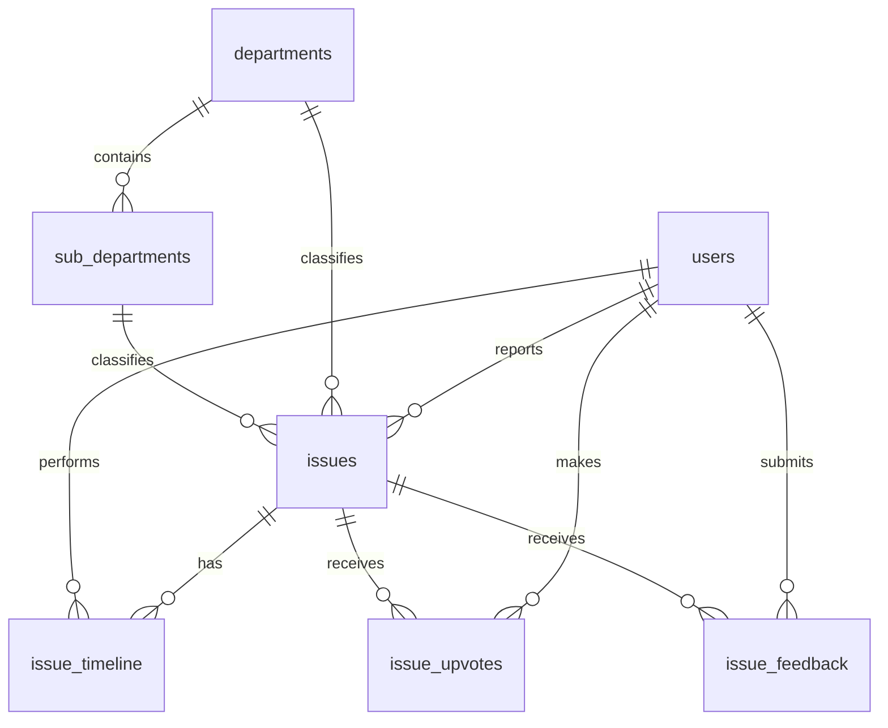

# ER Diagram Explanation - Civic Issue Portal

Last Updated: April 17, 2026

## 1. Overview

The database is centered around the Issue entity and is supported by identity, workflow, categorization, and engagement entities.

Main functional areas:
- User identity and roles
- Issue reporting and lifecycle
- Department and sub-department classification
- Timeline/audit events
- Upvotes and feedback

## 2. Core Entities

### 2.1 users
Purpose:
- Stores citizens and admins.

Key fields:
- id (PK)
- name, email, password
- role (citizen/admin)
- address, pincode, latitude, longitude
- created_at

### 2.2 issues
Purpose:
- Stores each civic complaint/report.

Key fields:
- id (PK)
- title, description
- category, severity
- status (pending, in_progress, resolved, rejected)
- priority, sla_hours
- latitude, longitude, address
- image
- issue_token (unique)
- user_id (FK to users)
- department_id (FK to departments, nullable)
- sub_department_id (FK to sub_departments, nullable)
- created_at, updated_at, deleted_at

### 2.3 departments
Purpose:
- Top-level municipal grouping.

Key fields:
- id (PK)
- name (unique)
- description
- created_at, updated_at

### 2.4 sub_departments
Purpose:
- Second-level classification under a department.

Key fields:
- id (PK)
- department_id (FK to departments)
- name
- description
- created_at, updated_at
- UNIQUE(department_id, name)

### 2.5 issue_timeline
Purpose:
- Audit trail for issue events (reported, status changed, etc.).

Key fields (as used by backend):
- id (PK)
- issue_id (FK to issues)
- action
- performed_by (FK-like reference to users.id)
- created_at

### 2.6 issue_upvotes
Purpose:
- User engagement for issue prioritization.

Key fields:
- issue_id (FK to issues)
- user_id (FK to users)
- created_at
- PRIMARY KEY(issue_id, user_id)

### 2.7 issue_feedback
Purpose:
- Post-resolution citizen feedback.

Key fields:
- id (PK)
- issue_id (FK to issues)
- user_id (FK to users)
- is_satisfied
- rating
- comment
- created_at
- UNIQUE(issue_id, user_id)

## 3. Relationship and Cardinality

1) users -> issues (1:N)
- One user can report many issues.
- Each issue belongs to one reporting user.

2) departments -> sub_departments (1:N)
- One department can have many sub-departments.
- Each sub-department belongs to one department.

3) departments -> issues (1:N, optional on issue side)
- One department can classify many issues.
- An issue may have null department_id.

4) sub_departments -> issues (1:N, optional on issue side)
- One sub-department can classify many issues.
- An issue may have null sub_department_id.

5) issues -> issue_timeline (1:N)
- One issue can have many timeline events.

6) users -> issue_timeline (1:N actor relationship)
- One user can perform many timeline actions.

7) users <-> issues via issue_upvotes (M:N)
- A user can upvote many issues.
- An issue can receive many upvotes.
- De-duplicated with composite PK(issue_id, user_id).

8) users <-> issues via issue_feedback (M:N with payload)
- A user can give feedback on many issues.
- An issue can receive feedback from many users.
- Limited to one feedback per user per issue by UNIQUE(issue_id, user_id).

## 4. Foreign Key Behavior

From backend table creation logic:

- issue_upvotes.issue_id -> issues.id ON DELETE CASCADE
- issue_upvotes.user_id -> users.id ON DELETE CASCADE

- issue_feedback.issue_id -> issues.id ON DELETE CASCADE
- issue_feedback.user_id -> users.id ON DELETE CASCADE

- sub_departments.department_id -> departments.id ON DELETE CASCADE

- issues.department_id -> departments.id ON DELETE SET NULL
- issues.sub_department_id -> sub_departments.id ON DELETE SET NULL

Implication:
- Deleting an issue/user clears dependent upvotes/feedback rows.
- Deleting a department removes its sub-departments.
- If a department/sub-department is removed, issue records remain but classification is nulled.

## 5. Conceptual ER Diagram (Mermaid)

## 6. Why This Model Works

- Clear ownership: each issue has a reporter.
- Strong auditability: timeline records all meaningful actions.
- Flexible taxonomy: optional department/sub-department links.
- Safe engagement tables: composite uniqueness prevents duplicates.
- Good delete semantics: cascades for dependent interaction rows, set-null for classification links.

## 7. Practical Notes

- issues.deleted_at is a soft-delete marker; most APIs filter deleted records out.
- issue_token provides external-friendly tracking ID format.
- Role-based operations (admin vs citizen) are enforced at API layer.
